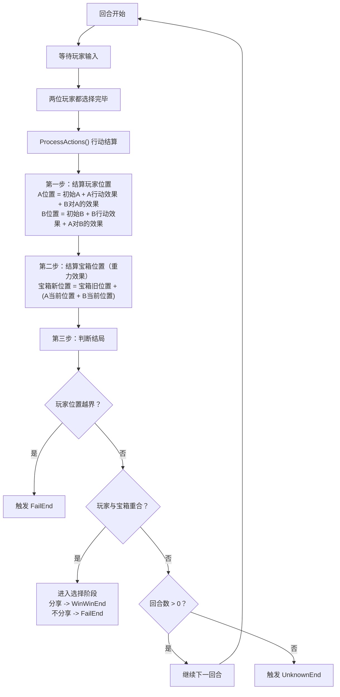

# Balance2D - TapTap GameJam 2025

一个基于Unity开发的2D平衡游戏，两名玩家需要通过策略性的行动来获取宝箱，同时考虑重力对宝箱位置的影响。

## 游戏机制

### 玩家行动类型
- **0 - Self_Add_1**: 自己位置+1
- **1 - Self_Minus_1**: 自己位置-1  
- **2 - Enemy_Add_1**: 敌人位置+1
- **3 - Enemy_Minus_1**: 敌人位置-1
- **4 - Enemy_Reverse**: 敌人位置取反
- **5 - Nothing**: 什么都不做

### 宝箱重力系统
每回合结算后，宝箱位置会受到重力影响：
```
宝箱新位置 = 宝箱旧位置 + (玩家A当前位置 + 玩家B当前位置)
```

### 游戏结局
- **FailEnd**: 玩家位置越界或选择不分享
- **WinWinEnd**: 玩家与宝箱重合且选择分享
- **UnknownEnd**: 回合数用完

## 游戏流程状态机



## 技术栈
- Unity 2022.x
- C#
- TextMeshPro UI

## 开发注意事项
- 游戏逻辑主要在 `ChallengeManager.cs` 中实现
- 支持热座模式（两个玩家轮流输入）
- 所有位置计算都在回合结算时同时进行，避免时序问题 